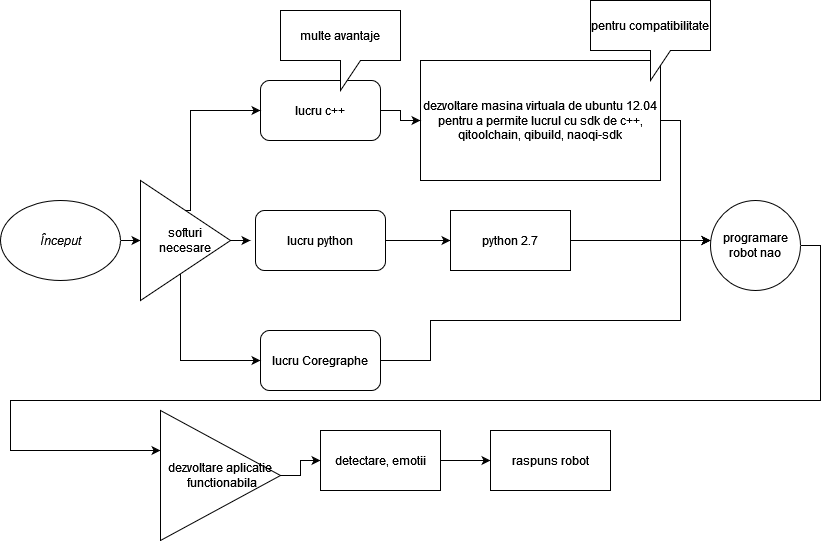

# Recunoașterea și imitarea emoțiilor de către robotul NAO

## analiza literaturii de specialitate din ultimii 5 ani

| Nr. | Autor(i) / An | Titlul articolului / proiectului | Aplicație / Domeniu1 | Tehnologii utilizate2 | Metodologie / Abordare3 | Rezultate4 | Limitări5 | Comentarii suplimentare6 |
|-----|---------------|----------------------------------|----------------------------------|----------------------------------|-------------------------------------|------------------------|------------------------|--------------------------------------|
| 1   | Chiara Filippini , David Perpetuini , Daniela Cardone, Arcangelo Merla (2021) | *Improving Human–Robot Interaction by Enhancing NAO Robot Awareness of Human Facial Expression* | recunoaștere facială, interacțiune om-robot, machine learning, afectiv computing | Robot NAO, CNN, OpenCV, FaceReader7 | Utilizare și extindere a modelului CNN pentru detectarea expresiilor faciale | Acuratețe de 91% pentru "fericit", 90% pentru "trist", 75% pentru "surprins" și "speriat" | Acuratețe scăzută pentru expresiile "neutru" și "furios"; sensibilitate la iluminat și orientarea feței | Studiul îmbunătățește detectarea emoțiilor pentru a crea o interacțiune mai naturală cu robotul NAO |
| 2   | Fabien Badeig, Quentin Pelorson, Soraya Arias, Vincent Drouard, Israel Gebru, Xiaofei Li, Georgios Evangelidis, Radu Horaud (2015) | *A Distributed Architecture for Interacting with NAO* | Interacțiune om-robot, Sisteme distribuite | Python, C++, OpenCV, Matlab, Platforme distribuite (CPU, GPU) | Arhitectură distribuită pentru extinderea resurselor de calcul ale robotului NAO | Îmbunătățește procesarea expresiilor faciale și analiza audio | Necesită cunoștințe avansate pentru dezvoltarea software-ului și resurse de calcul suplimentare | Simplifică sarcinile complexe prin folosirea resurselor externe pentru analiză detaliată |
| 3   | Ninad Mehendale (2020) | *Facial emotion recognition using convolutional neural networks (FERC)* | Recunoaștere emoțională, interacțiune HMI | CNN, Filtrare imagine | CNN pe două niveluri: eliminare fundal și extragere vector expresional (EV) | Acuratețe de 96% pentru 5 emoții de bază (fericire, tristețe, surpriză etc.) | Probleme cu orientarea imaginii și părul facial în prezența umbrelor sau a fețelor multiple | Algoritm aplicabil în detectarea minciunilor și analiza emoțională în educație |
| 4   |Katrin D. Bartl-Pokorny, Małgorzata Pykala, Pinar Uluer, Duygun Erol Barkana, Alice Baird, Hatice Kose, Tatjana Zorcec, Ben Robins, Björn W. Schuller și Agnieszka Landowska(2024)|*Robot-Based Intervention for Children With Autism Spectrum Disorder: A Systematic Literature Review* | Recunoaștere facială, interacțiune om-robot | Robot NAO, senzori(RGB-D, Kinect) |Testarea roboților interactivi (precum NAO) în dezvoltarea unor sisteme de terapie ce pot îmbunătăți abilitățile sociale și emoționale ale copiilor cu ASD | Utilizarea pe scară largă a roboților NAO în comunicarea dintre terapeuți și copiii cu ASD. Copiii au demonstrat îmbunătățiri în recunoașterea emoțiilor de bază, precum fericire, tristețe, frică și furie, atunci când au interacționat cu NAO | Capacitatea limitată a lui NAO de a gestiona abordări personalizate, de a diferenția emoțiile copiilor |                                      |
| 5   |Silvia Ramis, Jose Maria Buades, Francisco J. Perales(2020) | *Using a Social Robot to Evaluate Facial Expressions in the Wild*  | Recunoaștere facială, interacțiune om-robot, CNN, affective computing | Robot NAO, CNN, arhitecturi VGG, SCAE, DNN | Dezvoltarea unui sistem de interacțiune bazat pe NAO ce folosește CNN pentru recunoașterea expresiilor faciale umane. | Rezultate competitive ale recunoașterii emoțiilor de către NAO în comparație cu cele ale experților din domeniu | Confundarea emoțiilor neutre cu cele de furie, procesor limitat NAO în vederea sarcinilor de procesare pentru interacțiunea fluentă cu utilizatorul |  |

## Schema bloc

## Dependinte
Este folosita o versiune de ubuntu 12 pentru compatibilitate.

## Bilbiografie
1 https://www.mdpi.com/1424-8220/21/19/6438

2 https://link.springer.com/article/10.1007/s42452-020-2234-1

3 https://dl.acm.org/doi/10.1145/2818346.2823303

4 https://ieeexplore.ieee.org/stamp/stamp.jsp?tp=&arnumber=9635826

5 https://www.mdpi.com/1424-8220/20/23/6716
